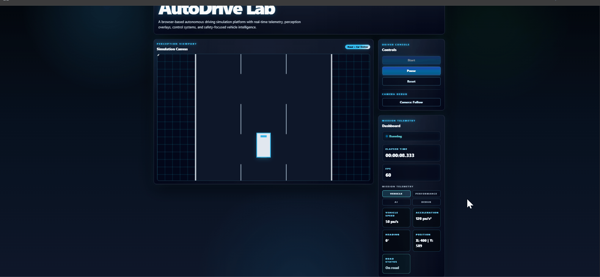

# AutoDrive ReactLab

A React + TypeScript self-driving car simulation lab built with canvas rendering, Zustand state management, keyboard controls, deterministic vehicle physics, camera following, dashboard telemetry, and Playwright E2E coverage.

## Project Status

```txt
Phase 1: MVP Moving Car on Road — Completed
```

## What Phase 1 Delivers

Phase 1 establishes the first playable simulation loop:

```txt
Start simulation
Pause simulation
Reset simulation
Drive forward
Brake / reverse
Steer left and right
Track speed, acceleration, steering, heading, position, FPS, and road status
Follow the vehicle with camera mode
Render road and car on canvas
Detect off-road state
Apply off-road speed penalty
Recover from severe road departure
Validate behaviour with unit and E2E tests
```

## Tech Stack

```txt
React
TypeScript
Vite
Tailwind CSS
Zustand
Canvas API
Vitest
Testing Library
Playwright
```

## Core Features

- Canvas-based simulation viewport
- Zustand-backed simulation state
- Start, pause, and reset lifecycle controls
- Keyboard driving controls
- Acceleration and brake/reverse input
- Steering input with return-to-center behaviour
- Vehicle movement physics
- Follow/fixed camera mode
- Procedural road rendering
- Dashboard telemetry
- Road departure warning
- Off-road speed penalty
- Severe off-road recovery reset
- Unit tests and Playwright E2E tests

## Running the Project

```bash
npm install
npm run dev
```

## Running Tests

```bash
npm test
npm run test:e2e
```

## Phase 1 Acceptance Summary

```txt
Car moves smoothly.
Car can reset.
Speed updates live.
No page reload is needed.
Keyboard input controls movement.
Camera can follow the vehicle.
Dashboard reflects live simulation state.
Off-road state is detected and handled safely.
Tests protect the MVP behaviour.
```

## Useful Scripts

```bash
npm run dev
npm test
npm run test:e2e
npm run build
npm run lint
```

## Current Architecture

```txt
src/
  app/
  components/
  hooks/
  simulation/
    camera/
    engine/
    vehicle/
    world/
  store/
  types/
  utils/

tests/
  e2e/
```

## Phase 1 Engineering Principles

- Physics is pure and testable.
- React owns UI, not per-frame drawing.
- Canvas owns rendering pixels.
- Zustand owns simulation runtime state.
- Keyboard input is normalized before physics.
- Road boundary detection is centralized.
- Camera affects rendering only.
- E2E tests verify user-visible behaviour.

## Car Physics

The vehicle uses a deterministic, frame-rate-independent kinematic physics model designed to be simple enough for learning while remaining extensible for future autonomous driving features.

### Physics Pipeline

Every simulation frame executes the following sequence:

```text
Keyboard Input
        │
        ▼
Input Normalisation
        │
        ▼
Acceleration / Brake
        │
        ▼
Friction
        │
        ▼
Off-road Speed Penalty
        │
        ▼
Speed Clamp
        │
        ▼
Steering Calculation
        │
        ▼
Heading Update
        │
        ▼
Position Update
        │
        ▼
Road Boundary Detection
        │
        ▼
Road Departure Warning
        │
        ▼
Recovery Check
```

### Vehicle Model

The vehicle state consists of:

- Position (X, Y)
- Heading (degrees)
- Speed
- Acceleration
- Steering angle
- Maximum forward speed
- Maximum reverse speed
- Friction
- Steering return rate

Each simulation frame produces a brand-new immutable `CarState`, making the physics deterministic and straightforward to test.

### Physics Features

Implemented:

- Forward acceleration
- Brake and reverse
- Passive rolling friction
- Steering angle limits
- Automatic steering return-to-centre
- Heading integration
- Position integration
- Off-road detection
- Off-road speed penalty
- Severe off-road recovery
- Camera following

### Design Goals

The physics engine is designed to be:

- Deterministic
- Pure
- Testable
- Extensible
- Independent of rendering
- Independent of React

Future phases can extend it with:

- Tyre slip
- Vehicle mass
- Weight transfer
- Suspension
- Collision response
- Multiple vehicle models
- AI driving controllers

---

# Keyboard Controls

The simulation supports keyboard-driven vehicle control.

| Key | Action          |
| --- | --------------- |
| ↑   | Accelerate      |
| ↓   | Brake / Reverse |
| ←   | Steer Left      |
| →   | Steer Right     |

Simulation controls:

| Button | Action                                       |
| ------ | -------------------------------------------- |
| Start  | Begins the simulation                        |
| Pause  | Stops physics updates                        |
| Reset  | Restores the simulation to its initial state |
| Camera | Toggle between Fixed and Follow camera       |

---

## 🎥 Demo

Below is a short demonstration of the completed **Phase 1 MVP**.

### Features Demonstrated

- 🚀 Launch application
- ▶️ Start simulation
- ⬆️ Accelerate vehicle
- ⬅️ Steer vehicle
- 📷 Toggle camera mode
- 🛣️ Leave the road
- ⚠️ Observe off-road warning
- ↩️ Return safely to the road
- 🔄 Trigger severe off-road recovery
- 🔁 Reset simulation

<p align="center">
  
</p>

> If the GIF does not render on GitHub, you can download it directly:
>
> **[View Demo GIF](./docs/images/autodrive-phase1.gif)**

---

# Testing

## Unit Tests

Run all unit tests:

```bash
npm test
```

Run tests in watch mode:

```bash
npm run test
```

Run a specific test file:

```bash
npm test -- src/store/simulationStore.test.ts
```

---

## End-to-End Tests

Execute Playwright tests:

```bash
npm run test:e2e
```

Run only Chromium:

```bash
npx playwright test --project=chromium
```

Run with the Playwright UI:

```bash
npx playwright test --ui
```

Open the HTML report:

```bash
npx playwright show-report
```

---

## Build Verification

Create a production build:

```bash
npm run build
```

Preview the production build locally:

```bash
npm run preview
```

---

## Quality Checklist

Before opening a Pull Request, verify that:

- All unit tests pass.
- All Playwright tests pass.
- The project builds successfully.
- ESLint reports no errors.
- TypeScript reports no type errors.
- The simulation starts correctly.
- Vehicle controls work.
- Camera modes work.
- Dashboard telemetry updates correctly.
- Road departure detection functions correctly.
- Off-road recovery functions correctly.

---

# Engineering Philosophy

AutoDrive ReactLab is intentionally structured as a teaching project.

The codebase prioritises:

- Clear architecture over premature optimisation.
- Pure functions over hidden side effects.
- Deterministic simulation behaviour.
- High unit-test coverage.
- Separation of rendering, simulation, and UI.
- Incremental feature development through well-defined work packages (WBS).

Each completed phase establishes a stable foundation for the next, allowing progressively more advanced autonomous driving capabilities to be added without introducing unnecessary technical debt.

## Next Phase

```txt
Phase 2: Sensors
```

Planned work:

```txt
Ray-casting sensors
Front / left / right sensor rays
Sensor distance calculation
Sensor overlay rendering
Road-edge detection
Sensor telemetry
```
